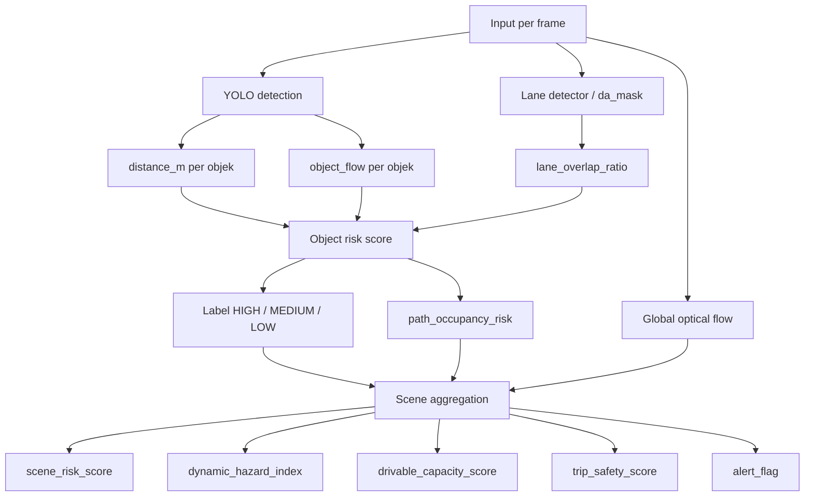
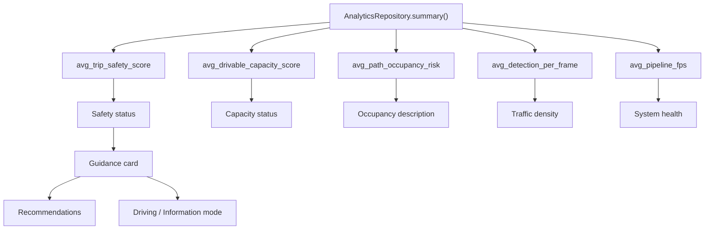

# 🚗 Assistance Car Perception System

Sistem persepsi kendaraan berbasis computer vision yang memproses video dari kamera stereo (Intel RealSense `.bag`) atau file video biasa (`.mp4`) untuk melakukan **object detection**, **depth estimation**, **global + object optical flow**, dan **risk assessment** secara real-time per frame. Hasil analisis disimpan ke database SQLite dan ditampilkan melalui antarmuka FastAPI Web UI sederhana (HTML).

---

## Daftar Isi

1. [Gambaran Umum](#1-gambaran-umum)
2. [Arsitektur Sistem](#2-arsitektur-sistem)
3. [Struktur Direktori](#3-struktur-direktori)
4. [Alur Data (Data Flow)](#4-alur-data-data-flow)
5. [Penjelasan Komponen](#5-penjelasan-komponen)
   - [Entry Points](#51-entry-points)
   - [Config](#52-config)
   - [Services](#53-services)
   - [Core — Pipeline](#54-core--pipeline)
   - [Core — Detection](#55-core--detection)
   - [Core — Depth](#56-core--depth)
   - [Core — Lane Detection](#56a-core--lane-detection)
   - [Core — Optical Flow](#57-core--optical-flow)
   - [Core — Risk Engine](#58-core--risk-engine)
   - [Core — Guidance Interpretation](#59-core--guidance-interpretation)
   - [Core — Video Output](#510-core--video-output)
   - [Database](#511-database)
   - [Utils](#512-utils)
6. [Skema Database](#6-skema-database)
7. [Output Artifacts](#7-output-artifacts)
8. [Cara Menjalankan](#8-cara-menjalankan)
9. [Dependensi](#9-dependensi)
10. [Catatan Pengembangan Lanjutan](#10-catatan-pengembangan-lanjutan)

---

## 📈 Performance Optimization Summary (v2.1+)

Sistem telah dioptimalkan secara signifikan untuk mencapai **real-time performance** dengan peningkatan **+92.5% throughput**:

| Komponen                     | Optimisasi                                            | Hasil                      |
| ---------------------------- | ----------------------------------------------------- | -------------------------- |
| 🚀**YOLO Detection**   | GPU CUDA + Input Resize (416×320) + FP16             | 84 ms → 76 ms (-10%)      |
| 🎬**Optical Flow**     | Resolution Reduction (50%) + Frame-Skipping (every 2) | 273 ms → 63 ms (-76.9%)   |
| 🛣️**Lane Detection** | Frame-Skipping (every 2) + Result Caching             | 150 ms → 82 ms avg (-45%) |

**Hasil Overall Pipeline:**

- **Baseline (CPU only):** 1202 ms/frame → **0.83 FPS**
- **After GPU+Optimizations:** 309 ms/frame → **4.08 FPS** (+92.5% 🎉)

**Breakdown Waktu (309 ms/frame):**

- Lane Detection: 28.2% (87 ms)
- YOLO: 23.2% (72 ms)
- Optical Flow: 20.5% (63 ms) ← optimized from 54.7%
- Risk Engine: 19.3% (60 ms)
- Scene Analysis: 3.6% (11 ms)

**Key Achievements:**

- ✅ GPU acceleration fully integrated (auto-detection, manual override support)
- ✅ Mixed-precision (FP16) inference for YOLO
- ✅ All optimizations configurable and reversible via `config/settings.py`
- ✅ Balanced bottleneck distribution (no single component exceeds 30%)

Untuk detail konfigurasi dan penyesuaian, lihat bagian [Pengaturan Optimisasi Throughput](#pengaturan-optimisasi-throughput--gpu-acceleration).

---

## 1. Gambaran Umum

Sistem ini dirancang untuk membantu pengemudi kendaraan dengan menganalisis kondisi jalan secara otomatis. Pengguna memasukkan rekaman dari kamera stereo Intel RealSense (format `.bag`) atau video biasa (`.mp4`), kemudian sistem melakukan:

| Fitur                                       | Deskripsi                                                                                                                                                           |
| ------------------------------------------- | ------------------------------------------------------------------------------------------------------------------------------------------------------------------- |
| **Object Detection**                  | Mendeteksi objek di jalan (kendaraan, pejalan kaki, dll.) menggunakan YOLO                                                                                          |
| **Depth Estimation**                  | Mengukur jarak objek ke kamera dari data depth stereo (dalam meter)                                                                                                 |
| **Optical Flow**                      | Menganalisis pergerakan global scene dan pergerakan tiap objek (ROI per-bounding-box) dari dense flow Farnebäck                                                    |
| **Lane + Drivable Segmentation**      | Segmentasi lajur dan area drivable menggunakan TwinLiteNetPlus                                                                                                      |
| **Risk Assessment**                   | Menilai level risiko setiap objek (HIGH / MEDIUM / LOW / UNKNOWN) dan risiko keseluruhan scene dengan mempertimbangkan status gerak objek                           |
| **Persistensi Data**                  | Menyimpan semua hasil analisis ke database SQLite (`perception.db`)                                                                                               |
| **Output Video**                      | Menghasilkan video anotasi dengan bounding box, jarak, level risiko, status gerak objek (MOV/STA), panah gerak, info scene flow, serta overlay inference time + FPS |
| **Audio Alert**                       | Menghasilkan file WAV dengan bunyi beep saat terdeteksi objek berisiko tinggi                                                                                       |
| **Performance Evaluation**            | Mengukur inference time per fitur, total pipeline latency, FPS, latency percentile (P50/P95), dan rata-rata deteksi per frame                                       |
| **Layperson Guidance Interpretation** | Mengkonversi metrik teknis kompleks menjadi rekomendasi human-friendly untuk pengemudi awam (e.g., "⚠️ HATI-HATI - Kurangi kecepatan")                            |
| **Dual-Mode Dashboard**               | Tampilan Information Mode (semua data teknis) dan Driving Mode (guidance ringkas untuk pengemudi)                                                                   |
| **Dashboard**                         | Menampilkan ringkasan analitik (risk + performance + guidance) melalui antarmuka FastAPI Web UI                                                                     |

---

## 2. Arsitektur Sistem

```
┌─────────────────────────────────────────────────────────────┐
│                        ENTRY POINTS                         │
│                                                             │
│    app.py (FastAPI UI)       run_backend.py (CLI)           │
└──────────────────────┬──────────────────────────────────────┘
                       │
┌──────────────────────▼──────────────────────────────────────┐
│                     SERVICES LAYER                          │
│                                                             │
│                    VideoService                             │
│           (Orchestrator utama per-run)                      │
│                                                             │
│   ┌─────────────────────┐   ┌──────────────────────────┐   │
│   │  BagFrameGenerator  │   │  VideoFrameGenerator     │   │
│   │  (.bag via          │   │  (.mp4 via OpenCV)       │   │
│   │   pyrealsense2)     │   │                          │   │
│   └─────────────────────┘   └──────────────────────────┘   │
└──────────────────────┬──────────────────────────────────────┘
                       │ FrameData stream
┌──────────────────────▼──────────────────────────────────────┐
│                      CORE LAYER                             │
│                                                             │
│                  PerceptionPipeline                         │
│                                                             │
│  ┌──────────────┐  ┌─────────────┐  ┌───────────────────┐  │
│  │ YOLODetector │  │ StereoDepth │  │ GlobalOpticalFlow │  │
│  │  (ultralytics│  │  (median    │  │  (Farnebäck       │  │
│  │   YOLO v11)  │  │   depth ROI)│  │   dense flow)     │  │
│  └──────┬───────┘  └──────┬──────┘  └────────┬──────────┘  │
│         │                 │                   │             │
│         │                 │          ┌────────▼──────────┐  │
│         │                 │          │ ObjectOpticalFlow │  │
│         │                 │          │ (per-bbox ROI     │  │
│         │                 │          │  motion stats)    │  │
│         │                 │          └────────┬──────────┘  │
│         └─────────────────▼───────────────────▼────────────┐│
│                        RiskEngine                           │
│             (per-object + scene-level risk)                 │
│                                                             │
│  ┌──────────────┐  ┌─────────────────────────────────────┐  │
│  │  FrameSaver  │  │           VideoBuilder              │  │
│  │  (PNG frames)│  │       + generate_alert_wav          │  │
│  └──────────────┘  └─────────────────────────────────────┘  │
└──────────────────────┬──────────────────────────────────────┘
                       │ INSERT
┌──────────────────────▼──────────────────────────────────────┐
│                    DATABASE LAYER                           │
│                                                             │
│              SQLite — perception.db                         │
│                                                             │
│   frames | detections | optical_flow | scene_metrics | lane_metrics | performance_metrics │
└─────────────────────────────────────────────────────────────┘
```

---

## 5. Penjelasan Komponen

### 5.1 Entry Points

#### `app.py` — FastAPI Web UI

Antarmuka utama berbasis web yang dijalankan dengan `uvicorn app:app --reload`.

Halaman web menyediakan:

1. **Mode Display Toggle** — Dua mode tampilan:

   - **📊 Information Mode**: Menampilkan Guidance Card + Semua metrik teknis (Perception Summary + Performance Evaluation) untuk engineering/expert users
   - **🚗 Driving Mode**: Menampilkan hanya Guidance Card dengan rekomendasi user-friendly untuk pengemudi awam
   - Mode preference disimpan di browser `localStorage`
2. Form input source (`bag` atau `mp4`)
3. **Guidance Card** — Interpretasi user-friendly dari kondisi perjalanan:

   - Emoji status (✅ AMAN / ⚠️ HATI-HATI / 🔴 BERBAHAYA / 🛑 KRITIS)
   - Main action recommendation
   - 4-column breakdown: Kondisi Jalan | Lalu Lintas | Pengisian Lajur | Kesehatan Sistem
   - Actionable recommendations
4. **Technical Metrics** (Information Mode hanya):

   - Perception Summary: Total Frames, Detections, Risk scores, Lane overlap, Flow, Capacity, Safety
   - Performance Evaluation: Inference time per stage, Total latency, FPS, P50/P95, Min/Max, Detections per frame
5. Preview video output dan audio alert

Alur di `app.py`:

1. `init_database()` dipanggil saat startup FastAPI
2. Saat endpoint `/process` dipanggil → file MP4 disimpan sementara (temporary file) atau path BAG langsung digunakan
3. `VideoService(YOLO_MODEL_PATH).process(source_path, source_type)` dijalankan
4. Setelah selesai → `AnalyticsRepository().summary()` dipanggil
5. Metrics di-pass ke `GuidanceInterpreter.generate_guidance()` untuk menghasilkan guidance human-friendly
6. Guidance card dan technical metrics ditampilkan sesuai display mode yang dipilih user

#### `run_backend.py` — CLI

Alternatif menjalankan sistem tanpa UI, menggunakan argumen command-line.

```bash
python run_backend.py --source path/to/file.bag --type bag
```

---

### 5.2 Config

#### `config/settings.py`

```python
BASE_DIR = Path(__file__).resolve().parent.parent  # → assistance_car/
YOLO_MODEL_PATH = BASE_DIR / "assets" / "models" / "yolo.pt"
```

Konfigurasi penting sekarang mencakup:

- `YOLO_MODEL_PATH` dan `LANE_MODEL_PATH`
- `RISK_CONFIG` untuk threshold jarak
- `RISK_FUSION_CONFIG` untuk penggabungan inti: bobot proximity, motion, lane, serta ambang alert scene
- `FLOW_CONFIG` dan `OBJECT_FLOW_CONFIG` untuk optical flow global + object-level
- **`GUIDANCE_CONFIG`** — Configuration untuk Guidance Interpretation System:
  - `enabled`: Enable/disable guidance feature (default: True)
  - `default_mode`: Mode tampilan default ("information" atau "driving")
  - `show_technical_metrics` / `show_guidance_metrics`: Toggle mana yang ditampilkan
  - Safety thresholds: `safety_critical_threshold` (22.0), `safety_danger_threshold` (42.0), `safety_caution_threshold` (68.0)
  - Capacity/Occupancy/Traffic/System thresholds untuk interpretasi metrik lainnya

### 🚀 Pengaturan Optimisasi Throughput & GPU Acceleration

Sistem telah dioptimalkan untuk mencapai **4.08 FPS** real-time processing (peningkatan **+92.5%** dari baseline awal 2.12 FPS). Semua optimisasi dapat dikonfigurasi dan dimatikan sesuai kebutuhan.

#### 📊 Perbandingan Performa

| Metrik                  | Baseline CPU | + CUDA     | + FP16     | + Flow Opt           | Peningkatan      |
| ----------------------- | ------------ | ---------- | ---------- | -------------------- | ---------------- |
| **Pipeline Time** | 1202 ms      | 504 ms     | 500 ms     | **309 ms**     | **-74.3%** |
| **FPS**           | 0.83         | 2.06       | 2.12       | **4.08**       | **+92.5%** |
| **Optical Flow**  | 267 ms       | 275 ms     | 273 ms     | **63 ms**      | **-76.9%** |
| **Bottleneck**    | Flow (67%)   | Flow (55%) | Flow (55%) | **Lane (28%)** | ✓ Balanced      |

#### 🔧 Konfigurasi Optimisasi

Semua optimisasi dapat diatur dari `config/settings.py`:

**1. YOLO Detection — GPU + Input Resize + FP16 Mixed-Precision**

```python
YOLO_CONFIG = {
    "confidence_threshold": 0.25,
    "input_resize_enabled": True,      # ← Enable/disable input resizing
    "input_width": 416,                # Resize input ke 416×320 (default: full resolution)
    "input_height": 320,
    "fp16_enabled": True,              # ← Enable/disable mixed-precision (auto-enabled on CUDA)
}
```

| Parameter                | Default  | Fungsi                                | Impact                      |
| ------------------------ | -------- | ------------------------------------- | --------------------------- |
| `input_resize_enabled` | `True` | Jalankan YOLO pada input 416×320     | YOLO: 76 ms → 61 ms (-20%) |
| `fp16_enabled`         | `True` | Mixed-precision inference (CUDA only) | YOLO: 84 ms → 76 ms (-10%) |

**2. Lane Detection — Frame-Skipping & Reuse**

```python
LANE_CONFIG = {
    "enabled": True,
    "model_size": "small",
    "process_every_n_frames": 2,      # ← Proses setiap 2 frame
    "reuse_previous_frame": True,     # ← Cache & reuse hasil
    "device": "cpu",
}
```

| Parameter                  | Default  | Fungsi                                                      | Impact                                              |
| -------------------------- | -------- | ----------------------------------------------------------- | --------------------------------------------------- |
| `process_every_n_frames` | `2`    | Lane detection setiap N frame, reuse untuk frame di-skip    | Lane: 82 ms → 82 ms per frame (saved ~50% compute) |
| `reuse_previous_frame`   | `True` | Cache hasil lane detection untuk digunakan frame berikutnya | Minimal visual loss, significant speedup            |

**3. Optical Flow — Resolution Reduction + Frame-Skipping**

```python
FLOW_OPTIMIZATION_CONFIG = {
    "batch_enabled": True,
    "batch_size": 2,
    "resolution_reduction_enabled": True,  # ← Enable/disable resolution scaling
    "resolution_scale": 0.5,               # Compute flow pada 50% resolusi
    "skip_enabled": True,                  # ← Enable/disable frame-skipping
    "skip_every_n_frames": 2,              # Compute flow setiap 2 frame
    "reuse_previous_flow": True,           # Cache & reuse flow untuk frame di-skip
}
```

| Parameter                        | Default  | Fungsi                                                      | Impact                                             |
| -------------------------------- | -------- | ----------------------------------------------------------- | -------------------------------------------------- |
| `resolution_reduction_enabled` | `True` | Compute optical flow pada 50% resolusi, scale velocity back | Flow: 273 ms → 95 ms (-65%)                       |
| `resolution_scale`             | `0.5`  | Faktor skala resolusi (0.5 = 25% memory/compute)            | Lebih rendah = lebih cepat tapi noise lebih tinggi |
| `skip_enabled`                 | `True` | Hanya compute flow setiap N frame                           | Flow: 95 ms → 63 ms (-34%)                        |
| `skip_every_n_frames`          | `2`    | Frame interval untuk flow computation                       | 2 = compute setiap 2 frame, 3 = setiap 3 frame     |
| `reuse_previous_flow`          | `True` | Gunakan flow frame sebelumnya untuk frame yang di-skip      | Minimal visual loss, balanced responsiveness       |

#### ⚙️ Cara Menyesuaikan Optimisasi

**Untuk Mode Kualitas Tinggi (mengorbankan kecepatan):**

```python
YOLO_CONFIG["input_resize_enabled"] = False      # Full resolution YOLO
YOLO_CONFIG["fp16_enabled"] = False              # Full precision
LANE_CONFIG["process_every_n_frames"] = 1        # Proses setiap frame
FLOW_OPTIMIZATION_CONFIG["resolution_reduction_enabled"] = False
FLOW_OPTIMIZATION_CONFIG["skip_enabled"] = False
```

**Untuk Mode Kecepatan Maksimal (mengorbankan akurasi):**

```python
YOLO_CONFIG["input_resize_enabled"] = True
YOLO_CONFIG["fp16_enabled"] = True
YOLO_CONFIG["input_width"] = 320                 # Lebih kecil lagi
YOLO_CONFIG["input_height"] = 256]
LANE_CONFIG["process_every_n_frames"] = 3        # Setiap 3 frame
FLOW_OPTIMIZATION_CONFIG["resolution_scale"] = 0.25  # Resolusi 25% saja
FLOW_OPTIMIZATION_CONFIG["skip_every_n_frames"] = 3
```

**Untuk Mode Balanced (default):**

```python
# Gunakan nilai default di atas — sudah optimal untuk real-time
# YOLO resize 416×320 + FP16 + Lane skip-2 + Flow 50% res + Flow skip-2
```

#### 🖥️ GPU Acceleration

Sistem mendukung GPU acceleration untuk YOLO detection:

**Requirements:**

- NVIDIA GPU dengan compute capability >= 3.5
- CUDA 12.1+ dan cuDNN 8.9+
- PyTorch dengan CUDA support: `pip install torch torchvision torchaudio --index-url https://download.pytorch.org/whl/cu121`

**Automatic Detection:**

```python
# Pipeline otomatis mendeteksi GPU dan menggunakan CUDA jika tersedia
pipeline = PerceptionPipeline(YOLO_MODEL_PATH, detector_device="auto")  # auto = GPU jika ada, else CPU
```

**Manual GPU Selection:**

```python
pipeline = PerceptionPipeline(YOLO_MODEL_PATH, detector_device="cuda")    # Force CUDA
pipeline = PerceptionPipeline(YOLO_MODEL_PATH, detector_device="cuda:0")  # GPU #0
pipeline = PerceptionPipeline(YOLO_MODEL_PATH, detector_device="cpu")     # Force CPU
```

#### 📈 Performance Profiling

Untuk mengukur performa sistem:

```bash
# Jalankan baseline measurement pada 200 frame
python -m tools.measure_baseline --source "path/to/file.bag" --type bag --max-frames 200 --device auto

# Output: baseline.csv dengan per-frame timing untuk setiap komponen
```

CSV output berisi:

- `pipeline_total_ms`: Total pipeline time per frame
- `pipeline_fps`: FPS per frame
- `yolo_ms`, `global_flow_ms`, `object_flow_ms`, `lane_ms`, `risk_ms`, `scene_ms`: Waktu per komponen

#### 🎯 Rekomendasi Optimisasi

| Use Case                         | Rekomendasi                         | FPS Target |
| -------------------------------- | ----------------------------------- | ---------- |
| **Real-time Streaming**    | Default settings (balanced)         | 3-4 FPS    |
| **Batch Video Processing** | Kurangi flow resolution ke 0.25     | 6-8 FPS    |
| **High-Accuracy Analysis** | Disable semua optimisasi            | 1-2 FPS    |
| **Embedded Systems**       | Max optimization (skip-3, res-0.25) | 8-10 FPS   |

Dengan cara ini kamu bisa kembali ke mode kualitas penuh kapan saja tanpa mengubah logika utama pipeline.

---

### 5.3 Services

#### `services/video_service.py` — `VideoService`

Orkestrator level "per run" — satu call ke `process()` menangani satu file input secara penuh.

Langkah-langkah `process()`:

1. `reset_database()` — Hapus data lama dari 5 tabel
2. `pipeline.reset()` — Reset state optical flow (prev_gray = None)
3. Tentukan `run_id` dari stem nama file input
4. Buat `FrameSaver(run_id)` — siapkan direktori temp frame
5. Pilih generator sesuai `source_type` (`BagFrameGenerator` atau `VideoFrameGenerator`)
6. Iterasi frame: `pipeline.process_frame(frame_data, frame_saver)` per frame
7. `VideoBuilder.build()` — rakit frame PNG jadi video MP4
8. `generate_alert_wav()` — buat audio WAV dari daftar alert flags

#### `services/bag_generator.py` — `BagFrameGenerator`

Membaca file `.bag` dari Intel RealSense menggunakan library `pyrealsense2`.

- Stream yang diaktifkan: `color` dan `depth`
- Mengekstrak **camera intrinsics** (fx, fy, ppx, ppy) langsung dari stream profile
- Menyusun `camera_matrix` 3×3:
  ```
  [[fx, 0,  cx],
   [0,  fy, cy],
   [0,  0,  1 ]]
  ```
- Batas maksimum frame: dari `PROCESSING_CONFIG["max_bag_frames"]` (default saat ini: `20000`)
- Menangani akhir file dengan `RuntimeError` (perilaku normal pyrealsense2)

#### `services/video_generator.py` — `VideoFrameGenerator`

Membaca file `.mp4` menggunakan OpenCV.

- Konversi BGR → RGB
- `depth_map` diisi `np.zeros(...)` karena tidak ada data depth di MP4
- `camera_matrix` diisi `np.eye(3)` (identity/dummy)
- Timestamp dari `cap.get(cv2.CAP_PROP_POS_MSEC) / 1000.0` (dalam detik)

---

### 5.4 Core — Pipeline

#### `core/pipeline.py` — `PerceptionPipeline`

Kelas inti yang mengorkestrasi seluruh pemrosesan per frame. Diinisialisasi satu kali per run dan memegang referensi ke semua model serta repository.

**Inisialisasi:**

```python
self.detector = YOLODetector(model_path)   # Model YOLO
self.depth    = StereoDepth()              # Depth estimator
self.flow     = GlobalOpticalFlow()        # Global optical flow (scene level)
self.object_flow = ObjectOpticalFlow()     # Object flow (per-bbox ROI)
self.risk_engine = RiskEngine()            # Risk calculator
```

**Per Frame (`process_frame`):**

1. Simpan metadata frame ke DB via `FrameRepository`
2. Jalankan YOLO detection
3. Hitung global optical flow (`flow_stats` + `flow_field`) → simpan `flow_stats` ke DB
4. Hitung object flow per deteksi dengan slicing ROI pada `flow_field`
5. Jalankan lane segmentation (bila aktif) → simpan ke DB
6. Untuk tiap objek: hitung jarak, lane overlap, motion score, lalu risk fusion per objek → simpan ke DB
7. Hitung scene fusion metrics (`scene_risk_score`, `path_occupancy_risk`, `dynamic_hazard_index`, `drivable_capacity_score`, `trip_safety_score`) → simpan ke DB
8. Gambar anotasi pada frame → simpan PNG via `FrameSaver`

**Return value tiap frame:**

```python
{
    "frame_id": int,
    "detections": [{"frame_id", "class_id", "confidence", "bbox",
      "distance_m", "risk", "risk_score", "lane_overlap_ratio", "object_flow"}, ...],
    "flow": {"mean_magnitude", "median_magnitude", "std_magnitude",
             "mean_dx", "mean_dy"} | None,
  "lane": {"lane_pixel_ratio", "drivable_pixel_ratio", ...} | None,
  "scene_metrics": {
    "scene_risk_score", "path_occupancy_risk", "dynamic_hazard_index",
    "drivable_capacity_score", "trip_safety_score", "alert_flag"
  },
    "scene_risk": int,  # jumlah HIGH risk objects
    "alert": bool       # True jika scene_risk > 0
}
```

**Anotasi Visual (`_draw_annotations`):**

- Bounding box berwarna berdasarkan risk + status gerak (moving objek ditampilkan dengan tone berbeda)
- Label: `{class_id} | {distance}m | {risk_level} | MOV/STA` (MOV memuat magnitude px/frame)
- Panah gerak ditampilkan untuk objek moving
- Info optical flow di pojok kiri atas: `Scene Flow: {mean_magnitude:.2f} px/f`
- Info scene risk: `Scene Risk: {scene_risk_score}`

---

### 5.5 Core — Detection

#### `core/detection/base_detector.py` — `BaseDetector`

Abstract base class dengan satu method yang wajib diimplementasi:

```python
def detect(self, image): raise NotImplementedError
```

#### `core/detection/yolo_detector.py` — `YOLODetector`

Wrapper untuk model YOLO dari library `ultralytics` dengan dukungan GPU acceleration dan mixed-precision inference.

**Fitur:**

1. **GPU Acceleration** — Auto-detection CUDA GPU, fallback ke CPU

   - Automatic device selection: `device="auto"` → GPU jika tersedia, else CPU
   - Manual override: `device="cuda"`, `device="cuda:0"`, atau `device="cpu"`
2. **Mixed-Precision Inference (FP16)** — Mengurangi inferensi time ~10% pada GPU

   - Auto-enabled when GPU detected dan `YOLO_CONFIG["fp16_enabled"] = True`
   - Uses `torch.cuda.amp.autocast()` untuk automatic precision casting
   - Inference: 84 ms (FP32) → 76 ms (FP16) pada RTX 3050 Ti
3. **Input Resize** — Menjalankan inference pada resolusi 416×320 (vs full resolution)

   - Mengurangi YOLO inference time ~20%
   - Bounding boxes automatically scaled back ke original image coordinates
   - Controlled via `YOLO_CONFIG["input_resize_enabled"]`

**Configuration:**

```python
YOLO_CONFIG = {
    "confidence_threshold": 0.25,      # Detection confidence minimum
    "input_resize_enabled": True,      # Scale input sebelum inference
    "input_width": 416,                # Target width saat resize
    "input_height": 320,               # Target height saat resize
    "fp16_enabled": True,              # Mixed-precision (CUDA only)
}
```

**Input/Output:**

- **Input:** RGB image (numpy array, shape H×W×3)
- **Output:** List of detection dicts:
  ```python
  {
      "bbox": [x1, y1, x2, y2],        # format xyxy (original resolution)
      "confidence": float,              # Confidence score (0-1)
      "class_id": int                   # YOLO class ID
  }
  ```

**Performance (RTX 3050 Ti):**

- Full resolution + FP32: ~84 ms/frame
- Resize + FP32: ~61 ms/frame (-27%)
- Resize + FP16: ~76 ms/frame (-10% vs FP32) ← default configuration

---

### 5.6 Core — Depth

#### `core/depth/stereo_depth.py` — `StereoDepth`

Mengekstrak estimasi jarak objek dari depth map stereo.

**Metode `compute_distance(depth_map, bbox)`:**

1. Potong ROI dari `depth_map` menggunakan koordinat bounding box
2. Filter: ambil hanya pixel yang **finite** dan **> 0** (membuang data tidak valid)
3. Butuh minimal **10 pixel valid**; jika kurang → return `None`
4. Return **median** dari pixel valid (dalam satuan meter untuk data RealSense, atau raw unit untuk format lain)

> **Catatan:** Untuk input `.mp4`, `depth_map` berisi semua nol sehingga semua jarak akan `None` dan risk akan `UNKNOWN`.

---

### 5.6a Core — Lane Detection

#### `core/lane/lane_detector.py` — `LaneDetector`

Mendeteksi lajur jalan dan area drivable menggunakan model TwinLiteNetPlus dengan optimisasi frame-skipping.

**Fitur:**

1. **Lane + Drivable Segmentation** — Output dua segmentation mask:

   - Lane pixels: Lajur jalan yang valid
   - Drivable pixels: Area yang aman untuk berkendara
2. **Frame-Skipping Optimization** — Compute setiap N frame, cache & reuse hasil

   - Mengurangi lane inference hingga **50%** compute time
   - Default: compute setiap 2 frame
   - Configurable via `LANE_CONFIG["process_every_n_frames"]` dan `reuse_previous_frame`
3. **Caching** — Hasil deteksi di-cache dan digunakan kembali untuk frame yang di-skip

   - Struktur hasil di-tag dengan `is_reused` flag
   - Minimal visual loss, balanced responsiveness

**Configuration:**

```python
LANE_CONFIG = {
    "enabled": True,                   # Enable/disable lane detection
    "model_size": "small",             # Model variant (small, medium, large)
    "input_h": 288,                    # Input height untuk model
    "input_w": 512,                    # Input width untuk model
    "process_every_n_frames": 2,       # Compute setiap N frame
    "reuse_previous_frame": True,      # Cache & reuse hasil
    "device": "cpu",                   # Device (cpu atau cuda)
}
```

**Output (per frame):**

```python
{
    "frame_id": int,
    "lane_pixel_ratio": float,         # Persentase lane pixels (0-1)
    "drivable_pixel_ratio": float,     # Persentase drivable pixels (0-1)
    "lane_mask": np.ndarray,           # Binary mask lane pixels
    "drivable_mask": np.ndarray,       # Binary mask drivable pixels
    "is_reused": bool                  # True jika hasil di-reuse dari frame sebelumnya
}
```

**Performance (CPU):**

- Full computation: ~150-160 ms/frame
- With frame-skip-2: ~82 ms/frame avg (50% compute saved)

---

### 5.7 Core — Optical Flow

#### `core/optical_flow/global_flow.py` — `GlobalOpticalFlow`

Menghitung pergerakan global seluruh scene menggunakan **dense optical flow Farnebäck** dengan optimisasi resolution reduction dan frame-skipping.

**Optimisasi (sejak v2.1+):**

1. **Resolution Reduction** — Optical flow dihitung pada resolusi lebih rendah (default 50%), lalu hasil di-scale kembali ke resolusi asli

   - Mengurangi waktu komputasi hingga **65%** (273 ms → 95 ms)
   - Preserves flow accuracy karena velocity scaling
   - Configurable via `FLOW_OPTIMIZATION_CONFIG["resolution_reduction_enabled"]` dan `resolution_scale`
2. **Frame-Skipping** — Compute flow setiap N frame, cache hasil untuk frame yang di-skip

   - Mengurangi komputasi hingga **50%** lebih lanjut (95 ms → 63 ms)
   - Total improvement untuk optical flow: **76.9%** (273 ms → 63 ms)
   - Minimal quality loss karena continuous reuse dalam 2-frame window
   - Configurable via `FLOW_OPTIMIZATION_CONFIG["skip_enabled"]` dan `skip_every_n_frames`

**Parameter Farnebäck:**

| Parameter      | Nilai | Fungsi                                             |
| -------------- | ----- | -------------------------------------------------- |
| `pyr_scale`  | 0.5   | Pyramid scale factor                               |
| `levels`     | 3     | Jumlah pyramid levels                              |
| `winsize`    | 15    | Averaging window size                              |
| `iterations` | 2     | Jumlah iterasi (optimization: reduced dari 3 ke 2) |
| `poly_n`     | 5     | Polynomial neighbourhood size                      |
| `poly_sigma` | 1.2   | Standard deviation untuk polynomial kernel         |

**Output (per frame, kecuali frame pertama yang return `None`):**

```python
(flow_stats, flow_field)

flow_stats = {
  "mean_magnitude":   float,          # Scene-level motion magnitude (px/frame)
  "median_magnitude": float,
  "std_magnitude":    float,
  "mean_dx":          float,          # Horizontal motion
  "mean_dy":          float           # Vertical motion
}

flow_field.shape == (H, W, 2)  # [dx, dy] per pixel (asli resolution)
```

**State Management:**

- `prev_gray`: Grayscale frame sebelumnya (maintained across frames)
- `prev_gray_reduced`: Grayscale frame sebelumnya pada reduced resolution (jika optimization aktif)
- `_last_result`: Cached flow result (untuk frame-skip reuse)
- `_frame_count`: Counter untuk tracking frame-skip intervals
- State direset setiap kali `pipeline.reset()` dipanggil (setiap run baru)

#### `core/optical_flow/object_flow.py` — `ObjectOpticalFlow`

Menghitung pergerakan per objek dari `flow_field` global, dengan cara mengambil ROI sesuai bounding box setiap deteksi.

Karakteristik implementasi:

- **Stateless**: tidak menyimpan state antar frame
- Input selalu `flow_field` terbaru dari pipeline (sudah dioptimalkan dan di-scale)
- Koordinat bbox di-clamp ke batas frame untuk mencegah out-of-bound
- Jika ROI tidak valid, hasil object flow untuk objek tersebut adalah `None`

**Output per objek:**

```python
{
  "object_magnitude": float,  # mean magnitude di ROI bbox (px/frame)
  "object_dx":        float,  # Rata-rata horizontal motion di bbox
  "object_dy":        float,  # Rata-rata vertical motion di bbox
  "is_moving":        bool    # object_magnitude > moving_threshold
}
```

Threshold gerak default di konfigurasi:

- `OBJECT_FLOW_CONFIG["moving_threshold"] = 1.5` px/frame

---

### 5.8 Core — Risk Engine

#### `core/calculation/risk_engine.py` — `RiskEngine`

Risk Engine sekarang dibuat lebih sederhana. Tujuannya bukan mencari "angka paling banyak", tapi memberi jawaban yang cukup jelas untuk 3 hal utama:

1. Apakah objek ini dekat?
2. Apakah objek ini bergerak?
3. Apakah objek ini menutupi jalur drivable?

Kalau tiga pertanyaan itu dijawab, sistem bisa membuat skor risiko objek dan skor risiko scene.

#### Parameter inti yang dipakai

Saat ini [RISK_FUSION_CONFIG](config/settings.py) hanya menyimpan parameter inti berikut:

- `object_high_threshold`
- `object_medium_threshold`
- `proximity_weight`
- `motion_weight`
- `lane_weight`
- `scene_alert_hazard_threshold`
- `scene_alert_occupancy_threshold`

Artinya:

- `object_high_threshold` dan `object_medium_threshold` dipakai untuk membagi objek menjadi `HIGH`, `MEDIUM`, atau `LOW`.
- `proximity_weight`, `motion_weight`, dan `lane_weight` dipakai untuk membentuk skor objek.
- `scene_alert_hazard_threshold` dan `scene_alert_occupancy_threshold` dipakai untuk menentukan apakah scene perlu alert.

#### Alur hitung risiko objek

Fungsi utama yang dipakai adalah `assess_object_risk(distance_m, object_flow, lane_result, bbox, class_id)`.

Cara kerjanya:

1. **Hitung overlap dengan jalur drivable**

   - Sistem mengambil `bbox` objek dan `da_mask` dari lane detector.
   - Hasilnya adalah `lane_overlap_ratio`.
   - Semakin besar overlap, semakin besar kemungkinan objek mengganggu jalur.
2. **Hitung skor jarak**

   - Input: `distance_m`.
   - Kalau objek sangat dekat, skornya tinggi.
   - Kalau objek lebih jauh, skornya turun.
3. **Hitung skor gerakan**

   - Input: `object_flow`.
   - Sistem membaca `object_magnitude` dan `is_moving`.
   - Objek yang bergerak lebih dianggap berisiko daripada objek diam.
4. **Gabungkan tiga sinyal inti**

   - Jarak diberi bobot 45%.
   - Gerakan diberi bobot 30%.
   - Okupansi jalur diberi bobot 25%.
   - Hasil gabungannya adalah `risk_score`.
5. **Ubah skor menjadi label risiko**

   - Jika `risk_score` besar sekali, labelnya `HIGH`.
   - Jika sedang, labelnya `MEDIUM`.
   - Jika kecil, labelnya `LOW`.
   - Kalau jarak tidak tersedia, sistem bisa memberi `UNKNOWN`.
6. **Hitung tambahan occupancy risk**

   - Sistem membuat `path_occupancy_risk` dari `risk_score * lane_overlap_ratio`.
   - Nilai ini dipakai sebagai sinyal tambahan untuk scene.

#### Alur hitung risiko scene

Setelah semua objek dihitung, `compute_scene_metrics()` membuat ringkasan scene:

- `scene_risk_score`
  - jumlah objek yang berlabel `HIGH`
- `path_occupancy_risk`
  - total occupancy risk dari semua objek
- `drivable_capacity_score`
  - gabungan kapasitas dari lane mask dan ruang jalan yang masih kosong
- `dynamic_hazard_index`
  - ringkasan bahaya scene dari risiko objek, occupancy, flow, dan objek yang bergerak
- `trip_safety_score`
  - skor keselamatan utama scene
- `alert_flag`
  - tanda apakah scene harus dianggap perlu perhatian

#### Diagram alur Risk Engine



**Inti sederhananya:** Risk Engine sekarang hanya menjawab apakah objek dekat, bergerak, dan mengganggu jalur. Sisanya adalah penggabungan dari tiga sinyal itu menjadi skor objek dan skor scene.

---

### 5.9 Core — Guidance Interpretation

#### `core/calculation/guidance_interpreter.py` — `GuidanceInterpreter`

Guidance Interpreter tugasnya sederhana: mengubah angka teknis dari Risk Engine menjadi kalimat yang mudah dipahami pengemudi.

#### Parameter yang dipakai Guidance

Guidance sekarang membaca 5 nilai utama dari hasil ringkasan database:

- `avg_trip_safety_score`
- `avg_drivable_capacity_score`
- `avg_path_occupancy_risk`
- `avg_detection_per_frame`
- `avg_pipeline_fps`

Jadi Guidance tidak menghitung ulang risk dari awal. Ia hanya membaca hasil akhir lalu mengubahnya menjadi status dan saran.

#### Cara kerja Guidance step by step

1. **Baca ringkasan metrics**

- Data diambil dari `AnalyticsRepository.summary()`.
- Ini adalah rata-rata dari seluruh frame yang sudah diproses.

2. **Ubah safety score menjadi status utama**

- Fungsi: `interpret_safety(trip_safety_score)`
- Hasilnya bisa `SAFE`, `CAUTION`, `DANGER`, atau `CRITICAL`.

3. **Ubah kapasitas jalan menjadi status jalan**

- Fungsi: `interpret_capacity(drivable_capacity_score)`
- Hasilnya bisa `OPEN`, `ADEQUATE`, `NARROW`, atau `BLOCKED`.

4. **Ubah occupancy menjadi deskripsi lajur**

- Fungsi: `interpret_occupancy(path_occupancy_risk)`
- Output-nya berupa kalimat seperti:
  - “Lajur sangat kosong”
  - “Lajur mulai penuh”
  - “Lajur hampir penuh”

5. **Ubah jumlah deteksi menjadi kepadatan lalu lintas**

- Fungsi: `interpret_traffic(avg_detection_per_frame)`
- Hasilnya bisa `EMPTY`, `NORMAL`, `HEAVY`, atau `CONGESTED`.

6. **Ubah FPS menjadi kesehatan sistem**

- Fungsi: `interpret_system_health(avg_pipeline_fps)`
- Hasilnya bisa `SMOOTH`, `ADEQUATE`, `LAGGY`, atau `CRITICAL`.

7. **Buat rekomendasi**

- Fungsi: `_generate_recommendations()`
- Rekomendasi dibuat dari kombinasi safety, capacity, traffic, dan system health.

#### Threshold yang dipakai Guidance

Semua threshold masih disimpan di [GUIDANCE_CONFIG](config/settings.py), tetapi sekarang penggunaannya lebih langsung dan tidak berlapis-lapis.

Yang dipakai:

- `safety_critical_threshold`
- `safety_danger_threshold`
- `safety_caution_threshold`
- `capacity_blocked_threshold`
- `capacity_narrow_threshold`
- `capacity_adequate_threshold`
- `occupancy_clear_threshold`
- `occupancy_moderate_threshold`
- `occupancy_high_threshold`
- `traffic_empty_threshold`
- `traffic_normal_threshold`
- `traffic_heavy_threshold`
- `system_laggy_threshold`
- `system_adequate_threshold`
- `system_smooth_threshold`

#### Diagram alur Guidance



#### Hasil akhirnya di UI

Guidance yang tampil di dashboard adalah gabungan dari:

- status utama: `SAFE`, `CAUTION`, `DANGER`, `CRITICAL`
- kondisi jalan
- deskripsi lajur
- kondisi lalu lintas
- kesehatan sistem
- daftar rekomendasi singkat

Jadi Guidance itu bukan hitungan baru, melainkan penerjemah hasil akhir dari Risk Engine menjadi bahasa yang lebih manusiawi.

---

### 5.10 Core — Video Output

#### `core/video/frame_saver.py` — `FrameSaver`

Menyimpan frame yang sudah dianotasi sebagai file PNG.

- Direktori: `assets/temp_frames/{run_id}/`
- Nama file: `frame_{frame_id:06d}.png` (zero-padded 6 digit)
- Direktori otomatis dihapus dan dibuat ulang di awal setiap run (overwrite)

#### `core/video/video_builder.py` — `VideoBuilder`

Merakit file PNG yang tersimpan menjadi satu file video MP4.

- Mencari semua `frame_*.png` di direktori input, diurutkan
- Codec: diambil dari konfigurasi (`VIDEO_CONFIG`)
- FPS: diambil dari source jika ada, fallback ke konfigurasi
- Dimensi video: diambil dari frame pertama secara otomatis

Setelah video silent selesai dibuat, `VideoBuilder.attach_audio()` melakukan mux audio alert WAV ke MP4 menggunakan FFmpeg.

#### `core/video/audio_alert.py` — `generate_alert_wav()`

Menghasilkan file audio WAV dengan sinyal peringatan.

| Parameter       | Nilai    |
| --------------- | -------- |
| Sample rate     | 44100 Hz |
| Frekuensi beep  | 1200 Hz  |
| Pulsa per detik | 3        |
| Duty cycle      | 35%      |
| Volume          | 35%      |

- Satu segmen audio dihasilkan per frame
- Jika `alert = False` → silence; jika `alert = True` → beep
- Durasi segmen = `1.0 / fps` detik

---

### 5.11 Database

#### `database/db.py`

| Fungsi               | Keterangan                                                         |
| -------------------- | ------------------------------------------------------------------ |
| `get_connection()` | Buka koneksi SQLite ke `perception.db`                           |
| `init_database()`  | Buat tabel jika belum ada (mengeksekusi `schema.sql`)            |
| `reset_database()` | Hapus isi 5 tabel (`DELETE FROM`) tanpa menghapus struktur tabel |

Path database: `assistance_car/perception.db` (relatif terhadap root modul).

#### `database/repository.py`

Enam kelas repository mengikuti pola **Repository Pattern** untuk memisahkan logika akses data:

| Repository                | Operasi                             | Tabel                |
| ------------------------- | ----------------------------------- | -------------------- |
| `FrameRepository`       | `insert(frame_data)`              | `frames`           |
| `DetectionRepository`   | `insert(det)`                     | `detections`       |
| `OpticalFlowRepository` | `insert(frame_id, flow_stats)`    | `optical_flow`     |
| `SceneRepository`       | `insert(frame_id, scene_metrics)` | `scene_metrics`    |
| `LaneRepository`        | `insert(frame_id, lane_stats)`    | `lane_metrics`     |
| `AnalyticsRepository`   | `summary()`                       | Semua tabel (SELECT) |

`AnalyticsRepository.summary()` mengembalikan:

```python
{
    "total_frames":     int,
    "total_detections": int,
    "high_risk_objects": int,
  "avg_object_risk_score": float | None,
  "avg_lane_overlap_ratio": float | None,
    "avg_flow":         float | None,
  "avg_scene_risk_score": float | None,
  "avg_path_occupancy_risk": float | None,
  "avg_dynamic_hazard_index": float | None,
  "avg_drivable_capacity_score": float | None,
  "avg_trip_safety_score": float | None,
    "avg_lane_ratio":   float | None,
    "avg_drivable_ratio": float | None
}
```

---

### 5.12 Utils

#### `utils/frame_models.py` — `FrameData`

Dataclass yang menjadi "kontrak data" antar komponen:

```python
@dataclass
class FrameData:
    frame_id:      int
    timestamp:     float
    rgb_image:     np.ndarray        # (H, W, 3) RGB
    depth_map:     np.ndarray        # (H, W) uint16 atau float
    camera_matrix: np.ndarray        # (3, 3)
    image_path:    Optional[str] = None
    depth_path:    Optional[str] = None
    detections:    List[Dict] = []
    flow_stats:    Optional[Dict] = None
    scene_risk:    Optional[float] = None
```

#### `utils/logger.py` — `get_logger(name)`

- Level logging: `INFO`
- Output: file `logs/system.log` **dan** console (stdout)
- Format: `{timestamp} | {level} | {name} | {message}`
- Logger di-cache per nama untuk menghindari duplikasi handler

---

## 6. Skema Database

Database: `perception.db` (SQLite)

### Tabel `frames`

Menyimpan metadata setiap frame yang diproses.

| Kolom          | Tipe       | Keterangan                              |
| -------------- | ---------- | --------------------------------------- |
| `frame_id`   | INTEGER PK | Indeks frame (mulai dari 0)             |
| `timestamp`  | REAL       | Waktu frame (detik)                     |
| `image_path` | TEXT       | Path ke image asli (null saat ini)      |
| `depth_path` | TEXT       | Path ke depth map asli (null saat ini)  |
| `fx`         | REAL       | Focal length X (dari intrinsics kamera) |
| `fy`         | REAL       | Focal length Y                          |
| `cx`         | REAL       | Principal point X                       |
| `cy`         | REAL       | Principal point Y                       |

### Tabel `detections`

Menyimpan setiap objek yang terdeteksi beserta estimasi jarak, level risiko, dan metrik object flow.

| Kolom                     | Tipe                     | Keterangan                                                        |
| ------------------------- | ------------------------ | ----------------------------------------------------------------- |
| `id`                    | INTEGER PK AUTOINCREMENT | ID unik deteksi                                                   |
| `frame_id`              | INTEGER FK               | Referensi ke tabel frames                                         |
| `class_id`              | INTEGER                  | ID kelas objek dari YOLO                                          |
| `confidence`            | REAL                     | Skor kepercayaan YOLO (0–1)                                      |
| `bbox_x1`               | REAL                     | Koordinat kiri bounding box                                       |
| `bbox_y1`               | REAL                     | Koordinat atas bounding box                                       |
| `bbox_x2`               | REAL                     | Koordinat kanan bounding box                                      |
| `bbox_y2`               | REAL                     | Koordinat bawah bounding box                                      |
| `distance_m`            | REAL                     | Jarak estimasi ke objek (meter)                                   |
| `risk_level`            | TEXT                     | `HIGH` / `MEDIUM` / `LOW` / `UNKNOWN`                     |
| `risk_score`            | REAL                     | Skor risiko objek hasil fusion                                    |
| `lane_overlap_ratio`    | REAL                     | Rasio overlap bbox dengan area drivable                           |
| `object_flow_magnitude` | REAL                     | Mean magnitude flow pada ROI objek (px/frame)                     |
| `object_flow_dx`        | REAL                     | Rata-rata komponen horizontal flow ROI objek                      |
| `object_flow_dy`        | REAL                     | Rata-rata komponen vertikal flow ROI objek                        |
| `is_moving`             | INTEGER                  | `1` moving, `0` stationary, `NULL` jika flow belum tersedia |

### Tabel `optical_flow`

Menyimpan statistik optical flow global per frame.

| Kolom                | Tipe          | Keterangan                          |
| -------------------- | ------------- | ----------------------------------- |
| `frame_id`         | INTEGER PK FK | Referensi ke tabel frames           |
| `mean_magnitude`   | REAL          | Rata-rata besaran pergerakan piksel |
| `median_magnitude` | REAL          | Median besaran pergerakan piksel    |
| `std_magnitude`    | REAL          | Standar deviasi besaran pergerakan  |
| `mean_dx`          | REAL          | Rata-rata pergerakan horizontal     |
| `mean_dy`          | REAL          | Rata-rata pergerakan vertikal       |

### Tabel `scene_metrics`

Menyimpan penilaian risiko tingkat scene per frame.

| Kolom                       | Tipe          | Keterangan                                                |
| --------------------------- | ------------- | --------------------------------------------------------- |
| `frame_id`                | INTEGER PK FK | Referensi ke tabel frames                                 |
| `scene_risk_score`        | REAL          | Jumlah objek HIGH risk di frame ini                       |
| `path_occupancy_risk`     | REAL          | Risiko okupansi path berdasarkan objek pada drivable area |
| `dynamic_hazard_index`    | REAL          | Indeks hazard dinamis gabungan objek + flow + occupancy   |
| `drivable_capacity_score` | REAL          | Kapasitas area drivable tersisa                           |
| `trip_safety_score`       | REAL          | Skor keselamatan agregat frame-level                      |
| `alert_flag`              | INTEGER       | `1` jika alert rule terpenuhi, `0` jika tidak         |

### Tabel `lane_metrics`

Menyimpan statistik segmentasi lane/drivable per frame.

| Kolom                    | Tipe          | Keterangan                              |
| ------------------------ | ------------- | --------------------------------------- |
| `frame_id`             | INTEGER PK FK | Referensi ke tabel frames               |
| `lane_pixel_ratio`     | REAL          | Persentase piksel lane terhadap frame   |
| `drivable_pixel_ratio` | REAL          | Persentase area drivable terhadap frame |

### Tabel `performance_metrics`

Menyimpan metrik performa inferensi per frame untuk evaluasi sistem.

| Kolom                 | Tipe          | Keterangan                                      |
| --------------------- | ------------- | ----------------------------------------------- |
| `frame_id`          | INTEGER PK FK | Referensi ke tabel frames                       |
| `yolo_ms`           | REAL          | Waktu inferensi deteksi YOLO (ms)               |
| `global_flow_ms`    | REAL          | Waktu komputasi global optical flow (ms)        |
| `object_flow_ms`    | REAL          | Waktu komputasi object optical flow (ms)        |
| `lane_ms`           | REAL          | Waktu inferensi lane/drivable segmentation (ms) |
| `risk_ms`           | REAL          | Waktu perhitungan depth + risk per object (ms)  |
| `scene_ms`          | REAL          | Waktu perhitungan scene fusion metrics (ms)     |
| `annotation_ms`     | REAL          | Waktu render anotasi frame (ms)                 |
| `pipeline_total_ms` | REAL          | Total waktu proses pipeline per frame (ms)      |
| `pipeline_fps`      | REAL          | FPS estimasi per frame ($FPS = 1000 / ms$)    |
| `detection_count`   | INTEGER       | Jumlah objek terdeteksi pada frame              |

**Diagram Relasi:**

```
frames (frame_id PK)
  ├── detections.frame_id (FK)
  ├── optical_flow.frame_id (FK, PK)
  ├── scene_metrics.frame_id (FK, PK)
  ├── lane_metrics.frame_id (FK, PK)
  └── performance_metrics.frame_id (FK, PK)
```

### Metrik yang Ditampilkan

UI FastAPI (card Performance Evaluation):

- Inference time per fitur/model: YOLO, global flow, object flow, lane, risk, scene, annotation
- Inference keseluruhan: average total latency, min/max latency
- Distribusi latency: P50 dan P95 total latency
- Throughput: average FPS
- Kompleksitas scene: average detection per frame

Overlay video/realtime:

- Per-frame total inference time (ms)
- Per-frame FPS

---

## 7. Output Artifacts

Setiap kali memproses file, sistem menghasilkan beberapa output:

| Artifact                    | Path                                             | Keterangan                                                      |
| --------------------------- | ------------------------------------------------ | --------------------------------------------------------------- |
| **Information video** | `assets/output/{run_id}_information.mp4`       | Video anotasi teknis lengkap (risk, flow, lane, inferensi, FPS) |
| **Driving video**     | `assets/output/{run_id}_driving.mp4`           | Video anotasi ringkas berbasis guidance untuk user awam         |
| **Audio alert**       | `assets/output/{run_id}_alert.wav`             | File WAV dengan beep saat HIGH risk                             |
| **Frame sementara**   | `assets/temp_frames/{run_id}/frame_XXXXXX.png` | Dibuat ulang tiap run                                           |
| **Database**          | `perception.db`                                | Data lengkap semua analisis (di-reset tiap run)                 |
| **Log**               | `logs/system.log`                              | Log detail setiap langkah pemrosesan                            |

> `run_id` diambil dari nama file input tanpa ekstensi (misalnya, input `recording.bag` → `run_id = recording`).

---

## 8. Cara Menjalankan

### Prasyarat

```bash
pip install ultralytics opencv-python numpy fastapi "uvicorn[standard]" python-multipart pyrealsense2 imageio-ffmpeg
```

Pastikan `ffmpeg` tersedia di PATH (atau set command FFmpeg lewat `config/settings.py`) untuk menggabungkan audio alert ke video output. Jika FFmpeg tidak tersedia di PATH, sistem akan mencoba fallback ke binary dari `imageio-ffmpeg`.

Pastikan file model YOLO tersedia di `assets/models/yolo.pt`.

### Opsi 1: FastAPI Web UI

```bash
cd assistance_car
uvicorn app:app --reload
```

Buka browser di `http://127.0.0.1:8000`, lalu:

1. Pilih **Source Type** (`bag` atau `mp4`)
2. Upload file `.mp4` atau masukkan path absolut file `.bag`
3. Klik **Process**
4. Tunggu proses selesai
5. Pilih **Mode Tampilan Dashboard**:

- **Information Mode**: guidance + metrik teknis lengkap
- **Driving Mode**: guidance ringkas untuk pengemudi awam

6. Pada panel output video, pilih **Mode Video Hasil**:

- **Information Video**: tampilan detail teknis
- **Driving Video**: tampilan sederhana dengan kata informatif (misalnya BERHENTI, HATI-HATI, lalu lintas ramai)

7. Pada panel realtime RealSense, pilih **Mode Realtime Overlay** (`information` / `driving`) sebelum memulai stream

### Opsi 2: CLI (Backend Only)

```bash
cd assistance_car

# Proses file .bag
python run_backend.py --source "C:/path/to/recording.bag" --type bag

# Proses file .mp4
python run_backend.py --source "C:/path/to/video.mp4" --type mp4
```

---

## 9. Dependensi

| Library              | Fungsi                                                   |
| -------------------- | -------------------------------------------------------- |
| `ultralytics`      | YOLO v11 object detection                                |
| `pyrealsense2`     | Membaca file `.bag` Intel RealSense                    |
| `opencv-python`    | Pemrosesan gambar, optical flow, video I/O               |
| `numpy`            | Komputasi numerik array                                  |
| `fastapi`          | Web framework untuk API + HTML UI sederhana              |
| `uvicorn`          | ASGI server untuk menjalankan FastAPI                    |
| `python-multipart` | Parsing upload file dari form HTML                       |
| `ffmpeg`           | Mux audio alert WAV ke video MP4                         |
| `imageio-ffmpeg`   | Fallback binary FFmpeg jika FFmpeg sistem tidak tersedia |
| `sqlite3`          | Database (stdlib Python)                                 |
| `wave`             | Generate file audio WAV (stdlib Python)                  |
| `dataclasses`      | FrameData model (stdlib Python)                          |
| `logging`          | Sistem logging (stdlib Python)                           |

---

## 10. Catatan Pengembangan Lanjutan

### Status Komponen (v2.1+)

| Komponen                                     | Status       | Keterangan                                                           |
| -------------------------------------------- | ------------ | -------------------------------------------------------------------- |
| **GPU Acceleration**                   | ✅ Aktif     | YOLO inference on CUDA GPU, auto-detection + manual override support |
| **Mixed-Precision (FP16)**             | ✅ Aktif     | YOLO inference dengan torch.cuda.amp.autocast() on CUDA devices      |
| **YOLO Input Resize**                  | ✅ Aktif     | Input resizing ke 416×320, automatic bbox scaling back              |
| **Lane Frame-Skipping**                | ✅ Aktif     | Lane detection setiap N frame dengan result caching                  |
| **Optical Flow Resolution Reduction**  | ✅ Aktif     | Flow computation pada 50% resolusi, velocity scaling back            |
| **Optical Flow Frame-Skipping**        | ✅ Aktif     | Flow computation setiap N frame dengan flow field reuse              |
| `core/lane/`                               | ✅ Aktif     | TwinLiteNetPlus lane + drivable segmentation dengan frame-skipping   |
| `core/optical_flow/object_flow.py`         | ✅ Aktif     | Object-level flow stateless berbasis ROI bbox                        |
| `core/calculation/guidance_interpreter.py` | ✅ Aktif     | Layperson guidance + dual-mode dashboard (Information/Driving)       |
| `core/frame_processor.py`                  | ⚠️ Kosong  | Placeholder untuk future frame preprocessing                         |
| `core/detection/rf_detr_detector.py`       | ⏳ Belum ada | Alternatif detector (RF-DETR)                                        |
| `core/depth/depth_anything.py`             | ⏳ Belum ada | Depth estimation monocular (tanpa stereo)                            |
| `core/calculation/fusion_engine.py`        | ⏳ Belum ada | Fusion dari berbagai sinyal risk                                     |
| `core/calculation/metrics.py`              | ⏳ Belum ada | Metrics evaluation                                                   |
| Output video playback di UI                  | ✅ Aktif     | Preview video + audio tersedia di halaman FastAPI                    |
| Halaman dashboard multi-page                 | ⏳ Belum ada | `ui/pages/` dari arsitektur target                                 |

### Kinerja Referensi (RTX 3050 Ti)

```
┌────────────────────────────────────────────────────────┐
│ Pipeline Performance Timeline                         │
├────────────────────────────────────────────────────────┤
│ Baseline (CPU-only YOLO):        1202 ms  (0.83 FPS)  │
│  → GPU CUDA enabled:              504 ms  (2.06 FPS)  │
│  → + FP16 mixed-precision:        500 ms  (2.12 FPS)  │
│  → + Flow optimization:           309 ms  (4.08 FPS)  │
│                                                        │
│ Improvement: +74.3% latency ↓ / +92.5% FPS ↑         │
└────────────────────────────────────────────────────────┘
```

### Topik Future Development

1. **Monocular Depth Estimation** — Menambahkan `DepthAnything` untuk processing video `.mp4` tanpa data stereo
2. **Alternative Detectors** — Implementasi RF-DETR atau YOLOv10 sebagai alternatif YOLO v11
3. **Advanced Fusion** — Fusion engine untuk kombinasi lebih sophisticated dari signal risk
4. **Real-time RealSense Streaming** — Dukungan streaming langsung dari kamera RealSense (bukan hanya file `.bag`)
5. **Multi-GPU Support** — Parallelisasi frame processing across multiple GPUs
6. **ONNX Export** — Mengekspor model ke format ONNX untuk deployment yang lebih ringan
